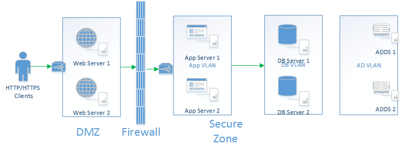

<properties 
   pageTitle="Setting up a DMZ in Azure Virtual Network" 
   description="This article demonstrates how to deploy a multi tier service in Azure with DMZ and appropriate network segmentation" 
   services="virtual-network" 
   documentationCenter="" 
   authors="narayanAnnamalai" 
   manager="jefco" 
   editor=""/>

<tags
   ms.service="virtual-network"
   ms.devlang=""
   ms.topic="article"
   ms.tgt_pltfrm="na"
   ms.workload="infrastructure-services" 
   ms.date="02/20/2015"
   ms.author="narayan"/>

# Setting up DMZ in Azure

## Overview

Azure network services offer a flexible and comprehensive feature set that allow you take many of your on premise applications and deploy them to Azure platform. When you are creating public facing web applications, one common application pattern used is deploying web servers in a DMZ (Demilitarized zone) and deploying rest of the applications in a secure zone behind a firewall. This article will demonstrate leveraging Azure virtual networks, public and internal load balancers along with recently released Network Security Groups to securely deploy a web application on Azure platform.


## On Premise Application

Here is a typical application running on premises, It has a web front end with 2 web servers, an application server tier with 2 application servers and a highly available database tier. All the servers belong to the same Active Directory domain. There are two active directory/dns servers as well. The two web servers are in DMZ. All the inbound HTTP/HTTPS traffic can only come to the Port 80/443 of the Web Servers. The application servers are in a App VLAN and they only accept traffic from Web Servers. Database Servers are in a DB VLAN and it only accepts traffic from the servers in App VLAN.




## Azure Application

Here is how the same application will be setup in Microsoft Azure Platform.

We will start with an Azure virtual network with 4 subnets.

The WebSubnet will have two web server virtual machines. All the requests coming to the web servers will be load balanced by Azure public load balancer. 

AppSubnet will have two application servers. All the requests coming to application servers will be load balanced by Azure internal load balancer. This load balancer is only accessible to the virtual machines in the virtual network. AppSubnet is secured with a Network security group which only allows requests from WebSubnet.

DBSubnet will have two database servers. All the requests coming to the database servers will be received by Azure internal load balancer. This is used to configure always on configuration of SQL Server 2012 or higher versions.

ADSubnet will have two Active Directory/DNS Servers. All the virtual machines belong to the same active directory domain. 


We will use powershell scripts to create this environment in Azure

## Implementation

1. Create Azure Virtual network with the desired subnets. You can do this in portal using wizards or take the below xml snippet and import.

```xml
<NetworkConfiguration xmlns:xsd="http://www.w3.org/2001/XMLSchema" xmlns:xsi="http://www.w3.org/2001/XMLSchema-instance" xmlns="http://schemas.microsoft.com/ServiceHosting/2011/07/NetworkConfiguration">
<VirtualNetworkConfiguration>

<Dns/>
<VirtualNetworkSites>
  <VirtualNetworkSite name="TypicalAppVnet" Location="Central US">
    <AddressSpace>
      <AddressPrefix>192.168.0.0/24</AddressPrefix>
    </AddressSpace>
    <Subnets>
      <Subnet name="WebSubnet">
        <AddressPrefix>192.168.0.0/28</AddressPrefix>
      </Subnet>
      <Subnet name="AppSubnet">
        <AddressPrefix>192.168.0.16/28</AddressPrefix>
      </Subnet>
      <Subnet name="DBSubnet">
        <AddressPrefix>192.168.0.32/27</AddressPrefix>
      </Subnet>
      <Subnet name="ADSubnet">
        <AddressPrefix>192.168.0.64/28</AddressPrefix>
      </Subnet>
    </Subnets>
  </VirtualNetworkSite>
</VirtualNetworkSites>
</VirtualNetworkConfiguration>
</NetworkConfiguration>
```
    
2. Once the VNet is created you can deploy the virtual machines in it. The first VMs should be the AD ones in the AD Subnet. [Creating an Active Directory Forest](http://azure.microsoft.com/en-us/documentation/articles/active-directory-new-forest-virtual-machine/)

3. Next is to create Web Servers in the WebSubnet. They are capable of receiving requests from public so they have a public load balanced end point. The below powershell script can be used to create these Web servers:

````powershell
### Configure the virtual machines to be created
$vm11 = New-AzureVMConfig -Name $WebServer1 -InstanceSize $InstanceSize -ImageName $image.ImageName -AvailabilitySetName $WebAvailabilitySetName  |  `
                Set-AzureSubnet $WebSubnet | ` 
                Add-AzureEndpoint -Name "HttpIn" -Protocol "tcp" -PublicPort 80 -LocalPort 8080 -LBSetName "WebFarm" -ProbePort 80 -ProbeProtocol "http" -ProbePath '/' | ` 
                Add-AzureProvisioningConfig -Windows -AdminUsername $credential.GetNetworkCredential().username -Password $credential.GetNetworkCredential().password 
 
$vm12 = New-AzureVMConfig -Name $WebServer2 -InstanceSize $InstanceSize -ImageName $image.ImageName -AvailabilitySetName $WebAvailabilitySetName | `
                Set-AzureSubnet $WebSubnet | `
                Add-AzureEndpoint -Name "HttpIn" -Protocol "tcp" -PublicPort 80 -LocalPort 8080 -LBSetName "WebFarm" -ProbePort 80 -ProbeProtocol "http" -ProbePath '/' | ` 
                Add-AzureProvisioningConfig -Windows -AdminUsername $credential.GetNetworkCredential().username -Password $credential.GetNetworkCredential().password 
 
 
# Make an array of the virtual machine configuration so we can create them with 1 call 
$vms = @($vm11, $vm12) 

#check to see if the cloud service for these virtual machines already exists 
$service = Get-AzureService -ServiceName $WebServiceName -ErrorAction SilentlyContinue             
     
if ($service -eq $null) 
{ 
    # Create a new cloud service and Deploy Virtual Machines to Virtual Network 
    New-AzureVM -ServiceName $WebServiceName -Location $DataCenter -VMs $vms -VNetName $VNetSiteName -ErrorVariable errorVariable -ErrorAction SilentlyContinue | Out-Null
} 
else 
{ 
    #Deploy Virtual Machines to Virtual Network 
    New-AzureVM -ServiceName $WebServiceName -VMs $vms -ErrorVariable errorVariable -ErrorAction SilentlyContinue | Out-Null
} 
 
if (!($?)) 
{ 
    throw "Unable to create virtual machines $WebServer1 and $WebServer2. Error detail is: $errorVariable" 
} 
else
{
    Write-Verbose "Successfully created virtual machines $WebServer1 and $WebServer2" 
} 

````

1. Once the web servers have been created you need to log into these servers, configure IIS and update the firewall rules to allow traffic over port 80
 
1. You can use the following PowerShell script to create the application servers in AppSubnet. Application servers are load balanced using internal load balancer. So the only server in the same virtual network can send requests to the load balanced end point for applications servers.

````powershell

#create the two application servers with Internal Load balancer
#Configure the virtual machines to be created
$vm11 = New-AzureVMConfig -Name $AppServer1 -InstanceSize $InstanceSize -ImageName $image.ImageName -AvailabilitySetName $AppAvailabilitySetName |  `
                Set-AzureSubnet $AppSubnet | ` 
                Add-AzureProvisioningConfig -Windows -AdminUsername $credential.GetNetworkCredential().username -Password $credential.GetNetworkCredential().password 
 
$vm12 = New-AzureVMConfig -Name $AppServer2 -InstanceSize $InstanceSize -ImageName $image.ImageName -AvailabilitySetName $AppAvailabilitySetName| `
                Set-AzureSubnet $AppSubnet | ` 
                Add-AzureProvisioningConfig -Windows -AdminUsername $credential.GetNetworkCredential().username -Password $credential.GetNetworkCredential().password 

# Make an array of the virtual machine configuration so we can create them with 1 call 
$vms = @($vm11, $vm12) 

#check to see if the cloud service for these virtual machines already exists 
$service = Get-AzureService -ServiceName $AppServiceName -ErrorAction SilentlyContinue             
     
if ($service -eq $null) 
{ 
    # Create a new cloud service and Deploy Virtual Machines to Virtual Network 
    New-AzureVM -ServiceName $AppServiceName -Location $DataCenter -VMs $vms -VNetName $VNetSiteName -ErrorVariable errorVariable -ErrorAction SilentlyContinue | Out-Null
} 
else 
{ 
    #Deploy Virtual Machines to Virtual Network 
    New-AzureVM -ServiceName $AppServiceName -VMs $vms -ErrorVariable errorVariable -ErrorAction SilentlyContinue | Out-Null
} 
 
if (!($?)) 
{ 
    throw "Unable to create virtual machines $AppServer1 and $AppServer2. Error detail is: $errorVariable" 
} 
else
{
    Write-Verbose "Successfully created virtual machines $AppServer1 and $AppServer2" 
}

# Add Internal Load Balancer to the service
Add-AzureInternalLoadBalancer -InternalLoadBalancerName AppILB -SubnetName AppSubnet -ServiceName $AppServiceName -ErrorVariable errorVariable -ErrorAction SilentlyContinue | Out-Null

if (!($?)) 
{ 
    throw "Unable to create internal load balancer on Service Name $AppServiceName. Error detail is: $errorVariable" 
} 
else
{
    Write-Verbose "Successfully created internal load balancer on Service Name $AppServiceName" 
}

# Add load balanced endpoints to ILB
Get-AzureVM -ServiceName $AppServiceName -Name $AppServer1 | Add-AzureEndpoint -Name "intappep" -LBSetName "intappeplb" -Protocol tcp -LocalPort 80 -PublicPort 80 -ProbePort 80 -ProbeProtocol tcp -ProbeIntervalInSeconds 10 -InternalLoadBalancerName AppILB | Update-AzureVM

if (!($?)) 
{ 
    throw "Unable to add internal load balanced endpoint to $AppServiceName and VM: $AppServer1." 
} 
else
{
    Write-Verbose "Successfully added internal load balanced endpoint to $AppServiceName and VM: $AppServer1." 
}

Get-AzureVM -ServiceName $AppServiceName -Name $AppServer2 | Add-AzureEndpoint -Name "intappep" -LBSetName "intappeplb" -Protocol tcp -LocalPort 80 -PublicPort 80 -ProbePort 80 -ProbeProtocol tcp -ProbeIntervalInSeconds 10 -InternalLoadBalancerName AppILB | Update-AzureVM 

if (!($?)) 
{ 
    throw "Unable to add internal load balanced endpoint to $AppServiceName and VM: $AppServer2." 
} 
else
{
    Write-Verbose "Successfully added internal load balanced endpoint to $AppServiceName and VM: $AppServer2." 
}

````

1. Once the application servers have been created you need to log into these servers, configure IIS and update the firewall rules to allow traffic over port 80.

1. Next is to create the database servers. This can be done by creating persistent VMS running SQL Server images.

Even though these virtual machines are created in different subnets there is nothing preventing these VM’s from communicating with each other. 
To test this out, you can try and connect to the Database Servers from the web servers. 

Log into your web server and install Telnet client using 
Server Manager –> Add Roles and Features->Telnet Client 

After that, open a new command prompt and run  
````
telnet 192.168.0.36 1433
````

*Make sure to open port 1433 in the firewall of the DB server*

192.168.0.36 is the internal IP address of the SQL Server VM. If the connection is successful you will see the cursor move to the top left corner of the command windows. If your connection fails you will get an error.

You will see that you can connect to the database server from both web server and application servers. If you want to **only** allow application servers to connect to database servers you have a few options:
1. You can use host firewall to only allow connections from application servers
2. You can use Network security groups at the VM level to only allow connections from application servers
3. You can use Network security groups at the subnet level to only allow connections from servers in the AppSubnet.

The preferred option is 3, since it is easier to manage Network ACLs at Subnet level with the added advantage of any new virtual machines deployed in the subnet automatically inheriting the security group rules.


## Network Security Groups

Network Security Groups (NSG) provides segmentation within a Virtual Network (VNet) as well as full control over traffic that ingresses or egresses a virtual machine in a VNet. A NSG can contain upto 200 rules each with a unique priority. The rules are executed in the order of lowest priority first.

To protect the servers in DBSubnet you need to create these rules to only servers in the AppSubnet to communicate with DBSubnet over port 1433.


| Name | Priority | Source IP | Source Port | Destination IP | Destination Port | Protocol | Access |
| ---- | -------- | --------- | ----------- | -------------- | ---------------- | -------- | ------ |
| DBDENY | 100 | 192.168.0.0/28 | * | 192.168.0.32/27 | * | TCP | DENY |
| DBALLOW | 101 | 192.168.0.0/28 | * | 192.168.0.32/27 | 1433 | TCP | ALLOW |
| RDPALLOW | 65500 | INTERNET | * | 192.168.0.32/27 | 3389 | TCP | DENY |

	
To protect the servers in AppSubnet you need to create these rules to only allow servers in WebSubnet to send requests to the AppSubnet. 

| Name | Priority | Source IP | Source Port | Destination IP | Destination Port | Protocol | Access |
| ---- | -------- | --------- | ----------- | -------------- | ---------------- | -------- | ------ |
| APPDENY | 100 | 192.168.0.32/27 | * | 192.168.0.16/28 | * | TCP | DENY |
| RDPALLOW | 101 | INTERNET | * | 192.168.0.16/28 | 3389 | TCP | ALLOW |
| WEBALLOW | 102 | 192.168.0.0/28 | * | 192.168.0.16/28 | 80 | TCP | ALLOW |


The  below script creates network security groups and assigns them to DBSubnet and AppSubnet

````powershell

#Only allow traffic from AppSubnet to come to DBSubnet
#Create a Network Security Group
New-AzureNetworkSecurityGroup -Name "DBSG" -Location $DataCenter -Label "Security group for DBSubnet in virtual network $VNetSiteName in Central US"

#Add a rule to deny WebSubnet access to DBSubnet
Get-AzureNetworkSecurityGroup -Name "DBSG" | Set-AzureNetworkSecurityRule -Name DBDENY -Type Inbound -Priority 100 -Action Deny -SourceAddressPrefix '192.168.0.0/28'  -SourcePortRange '*' -DestinationAddressPrefix '192.168.0.32/27' -DestinationPortRange '*' -Protocol TCP
#Add a rule to allow AppSubnet to the DBSubnet
Get-AzureNetworkSecurityGroup -Name "DBSG" | Set-AzureNetworkSecurityRule -Name DBALLOW -Type Inbound -Priority 101 -Action Allow -SourceAddressPrefix '192.168.0.16/28'  -SourcePortRange '*' -DestinationAddressPrefix '192.168.0.32/27' -DestinationPortRange '1433' -Protocol TCP
#Add a rule to allow RDP Connections into the DBSubnet. Only do this if you want to allow RDP connections from internet
Get-AzureNetworkSecurityGroup -Name "DBSG" | Set-AzureNetworkSecurityRule -Name RDPALLOW -Type Inbound -Priority 102 -Action Allow -SourceAddressPrefix 'INTERNET'  -SourcePortRange '*' -DestinationAddressPrefix '192.168.0.32/27' -DestinationPortRange '3389' -Protocol TCP
#Assign the network security group DBSubnet
Get-AzureNetworkSecurityGroup -Name "DBSG" | Set-AzureNetworkSecurityGroupToSubnet -VirtualNetworkName $VNetSiteName -SubnetName $DBSubnet

#Only allow traffic from WebSubnet to come to AppSubnet
#Create a Network Security Group
New-AzureNetworkSecurityGroup -Name "APPSG" -Location $DataCenter -Label "Security group for APPSubnet in virtual network $VNetSiteName in Central US"
#Add a rule to deny DBSubnet access to AppSubnet
Get-AzureNetworkSecurityGroup -Name "APPSG" | Set-AzureNetworkSecurityRule -Name APPDENY -Type Inbound -Priority 102 -Action Deny -SourceAddressPrefix '192.168.0.32/27'  -SourcePortRange '*' -DestinationAddressPrefix '192.168.0.16/28' -DestinationPortRange '*' -Protocol TCP
#Add a rule to allow WebSubnet access to AppSubnet
Get-AzureNetworkSecurityGroup -Name "APPSG" | Set-AzureNetworkSecurityRule -Name APPALLOW -Type Inbound -Priority 103 -Action Allow -SourceAddressPrefix '192.168.0.0/28'  -SourcePortRange '*' -DestinationAddressPrefix '192.168.0.16/28' -DestinationPortRange '80' -Protocol TCP
#Add a rule to allow RDP from internet to AppSubnet. Only do this if you want to allow RDP connections from internet
Get-AzureNetworkSecurityGroup -Name "APPSG" | Set-AzureNetworkSecurityRule -Name RDPALLOW -Type Inbound -Priority 103 -Action Allow -SourceAddressPrefix 'INTERNET'  -SourcePortRange '*' -DestinationAddressPrefix '192.168.0.16/28' -DestinationPortRange '3389' -Protocol TCP
#Assign the network security group AppSubnet
Get-AzureNetworkSecurityGroup -Name "APPSG" | Set-AzureNetworkSecurityGroupToSubnet -VirtualNetworkName $VNetSiteName -SubnetName $AppSubnet

````

Once you have applied Network Security Groups you will be unable to RDP to the virtual machine because default Network Security Groups do not allow traffic from the internet. You will have to create explicit rules to allow RDPO access into the VMs.

Once the Network Security group is created and applied, you could try the following:

1. RDP into a web server and try to access IIS over an internal ILB address 192.168.1.21 and you will see the default IIS web page.
2. Test connectivity from web server to a DBServer using telnet IP_Address 1433 and the connection will fail because DBSubnet only allows traffic from AppSubnet.
3. Log into an Application Server VM and test connectivity to DB Server using telnet IP_Address 1433 and you will be able to successfully connect.

# Summary

The exercise demonstrated that by leveraging features like Azure virtual network, public and internal load balancer and network security groups to an on-premise application can be securely deployed in Azure. 